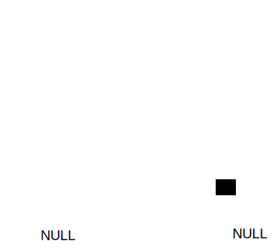
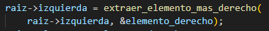

# TDA ABB

## Repositorio de Valentin Calomino - 109665 - vcalomino@fi.uba.ar

- Para compilar:

```bash
gcc -std=c99 -Wall -Wconversion -Wtype-limits -pedantic -Werror -O2 -g src/*.c pruebas_chanutron.o -o pruebas_chanutron

gcc -std=c99 -Wall -Wconversion -Wtype-limits -pedantic -Werror -O2 -g src/*.c pruebas_alumno.c -o pruebas_alumno
```

- Para ejecutar:

```bash
./pruebas_chanutron

./pruebas_alumno
```

- Para ejecutar con valgrind:
```bash
valgrind ./pruebas_chanutron

valgrind ./pruebas_alumno
```
---
##  Funcionamiento

La estructura del arbol binario de busqueda esta compuesta por nodos de la siguiente manera:



En los arboles binarios se pueden realizar ciertas operaciones como insertar, buscar y eliminar elementos (ver Respuestas a las preguntas teóricas para ver mi implementacion).

A su vez para saber si el arbol esta o no vacio se lleva un contador para el tamaño que se incrementa al insertar y achica al quitar.

Y tambien se provee de dos funciones destructoras. Una para el arbol y sus nodos, y la otra tambien para los elementos que estan dentro de los nodos en caso de ser necesario.

---

## Respuestas a las preguntas teóricas
Un arbol es un conjunto de nodos que se distribuyen jerarquicamente y pueden estar conectados a otros nodos. El nodo principal es la raíz y a el se conectan, o no, más nodos formando asi subarboles.


Los arboles binarios son aquellos en los cuales cada nodo posee dos hijos como maximo, permitiendo tener la nocion de izquierda y derecha.


Por ultimo, los arboles binarios de busqueda se diferencian de los arboles binarios en que poseen un orden. Cada nodo posee una clave o valor que se utiliza para comparar mediante una funcion con los demas valores y ubicarlos en base a la convencion establecida.


Las operaciones en los arboles son: crear, destruir, insertar un elemento, borrar un elemento, buscar un elemento, ver si esta vacio, y recorrerlo.

En el caso de los arboles n-arios, las operaciones insertar, borrar y buscar un elemento son de complejidad O(n), ya que es necesario iterar sobre cada elemento del arbol.

Luego, las operaciones de los arboles binarios son las mismas que de un arbol n-ario (ya que un arbol binario es un arbol n-ario pero con dos nodos hijos cada padre).
El caso de las operaciones insertar, borrar y buscar un elemento son similares a las de un arbol n-ario ya que al no estar ordenados los elementos hay que recorrer el arbol igualmente.

Por ultimo, en los arboles binarios de busqueda, si suponemos que se encuentran balanceados,
las operaciones de insertar, borrar y buscar son O(log n) ya que como el arbol tiene cierto orden, siempre dividimos el problema a la mitad.

En todos los arboles, las operaciones de crear y ver si esta vacio las consideramos O(1), ya que solo requieren de reservar memoria (lo que consideramos que es una operacion de tiempo constante) o fijarse si existe la raiz del arbol (lo que tambien es de tiempo constante ya que se cuenta con una referencia a la raiz).
Por otro lado las operaciones de destruir y de recorrido, en todos los arboles son O(n) ya que se requiere iterar en cada elemento para realizar la respectiva accion en el (liberar su memoria/devolverlo).

---

El arbol binario de busqueda lo implemente de la siguiente manera:


donde la funcion comparador toma dos elementos y devuelve >0 si el primero es mayor al segundo, <0 si el segundo es mayor al primero y ==0 si ambos son iguales.

Las funciones se implementaron en su mayoria recursivamente, debido a que la naturaleza del arbol es recursiva, lo que hacia mas sencillo pensarlas de esa manera.

Por ejemplo, la operacion de buscar. Se utilizo una funcion wrapper (que es la de buscar) y la funcion recursiva en si que recibe la raiz del arbol en primera instancia. Luego dependiendo del valor de la funcion comparadora, se dividia el arbol en dos y se llamaba con la parte izquierda o la parte derecha respectivamente.

Luego la funcion de quitar, es similar a la de buscar pero con la dificultad extra de reemplazar el nodo por su predecesor inorden. El caso mas complicado es cuando el que quitas tiene dos hijos. Para salvaguardar este caso, se utiliza la funcion "extraer_elemento_derecho"  que busca el predecesor inorden del elemento que voy a quitar para "engancharlo" en el lugar del que sale.


En este ejemplo si quisiera eliminar la raiz, para encontrar su predecesor inorden debo ir una vez a la izquierda y luego hacia la derecha hasta el final. En estos fragmentos de codigo vemos esta idea:




-Llamo a la parte izquierda una vez.


-Voy recursivamente hasta la derecha hasta encontrar el NULL.

Una aclaracion sobre esta funcion es que utilice una variable booleana extra para el caso en el que encuentro el elemento que quiero sacar pero casualmente este es NULL (que es el valor en caso de error tambien).

---

Las funciones de recorrido y recorrido con array tambien se implementaron de forma recursiva.
Se crearon funciones para cada recorrido especifico en el que se produce un llamado a la parte izquierda, la iteracion del elemento (o agregar el elemento al array) y el llamado a la parte derecha en el orden que corresponde al recorrido. Cabe aclarar que se hizo que estas funciones devuelvan un valor booleano para determinar si debian continuar o no la iteracion.

Ejemplo recorrido inorden:


Ejemplo recorrido con array postorden:


---


El unico caso distinto es el de la funcion de insertar, ya que se me hizo mas facil pensarlo como la insercion en una lista enlazada, pero considerando que esta estuviese "bifurcada".
De igual manera, la implementacion recursiva hubiese sido similar a las otras funciones.


En la imagen podemos ver la bifurcacion mencionada. Si el comparador es mayor o igual a cero considero la parte izquierda, en otro caso considero la parte derecha.

